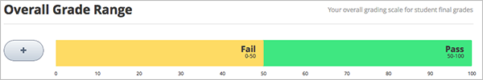
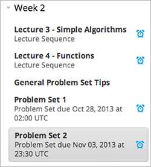

––.. _Establish a Grading Policy:

##############################
Définition d'une politique de notation  
##############################

*******************
Présentation
*******************

La définition d'une politique de notation comporte plusieurs étapes. Vous devez :

#. :ref:`définir la plage d'évaluation ;`
#. :ref:`définir le délai supplémentaire ;`
#. :ref:`configurer les types de travaux ;`
#. :ref:`définir le type des travaux des sous-sections notées ;`
#. :ref:`définir la vue Étudiant des notes.`

.. _Set the Grade Range:

*******************
Définir la plage d'évaluation
*******************

Vous devez définir la plage d'évaluation du cours.  Votre cours peut, par exemple, être sanctionné par un examen final. En cas de résultats satisfaisants, le cours est validé. En cas de résultats insatisfaisants, le cours n'est pas validé. Votre cours peut également faire l'objet d'une notation (lettres A à F).

Pour définir la plage d'évaluation, dans le menu **Paramètres**, sélectionnez **Évaluation**.

L'option de la plage d'évaluation est située en haut de la page Évaluation.

Dans l'exemple ci-dessus, la plage d'évaluation est basée sur un examen final (réussite/échec à un examen en fonction des résultats obtenus), la note de 50 constituant le seuil de notation (note de passage). Ce seuil correspond au paramètre par défaut utilisé lors de la création d'un cours.

Pour modifier ces paramètres, vous devez utiliser l'option de la plage d'évaluation :

* Pour ajouter une note à la plage d'évaluation, cliquez sur l'icône **+**.

  Une nouvelle note est ajoutée. Elle est insérée entre les notes existantes. Par exemple, si vous ajoutez une note au niveau du paramétrage par défaut, la plage d'évaluation est modifiée. Les valeurs suivantes sont alors utilisées : **F** (de 0 à 50), **B** (de 50 à 75) et **A** (de 75 à 100) :

  .. image:: ../Images/grade_range_b.png
    :alt: Image présentant une option de la plage d'évaluation modifiée

* Pour modifier la plage d'évaluation, faites passer le curseur de la souris au-dessus de la ligne entre deux notes, cliquez sur la ligne, puis faites glisser le curseur vers la gauche ou vers la droite.

  Les numéros des deux notes voisines de la ligne sont alors modifiés.
  Relâchez le bouton de la souris lorsque la ligne est positionnée au niveau souhaité.
  
* Pour modifier le nom de l'évaluation, double-cliquez sur le nom actuel de l'évaluation pour le sélectionner, puis saisissez le nom de la nouvelle évaluation. Par exemple, si le nom d'origine de l'évaluation est "Pass" (Réussite à l'examen), vous pouvez double-cliquer sur "Pass", puis le remplacer par "Excellent".

  Vous ne pouvez modifier ni **F** ni **Fail** (Échec à l'examen). 

* Pour supprimer une note, faites passer le curseur de la souris au-dessus de la note. 

  Un lien de **suppression** apparaît au-dessus de la note. Cliquez sur ce lien.
  
  Vous ne pouvez supprimer ni F ni A.
  
Après avoir effectué une ou plusieurs modifications dans la plage d'évaluation, cliquez sur l'option **Enregistrer les modifications**, située au bas de la page.

.. _Set the Grace Period:

*************************
Définir le délai supplémentaire 
*************************
    
Vous pouvez définir un délai supplémentaire et ainsi repousser la date d'échéance des travaux de vos étudiants. 

.. note:: Le délai supplémentaire s'applique à l'intégralité du cours ; vous ne pouvez pas définir de délai supplémentaire pour les travaux individuels.
  
Sur la page Évaluation, sous **Règles de notation**, saisissez une valeur dans le champ **Délai supplémentaire après la date limite**. Saisissez la valeur au format Heures:Minutes.

.. _Configure the Assignment Types:

******************************
Configurer les types de travaux
******************************

Vous devez créer des types de travaux pour votre cours et définir ce que représente chaque type de travail (en pourcentage) dans la note totale de l'étudiant.

Par exemple, vous pouvez avoir :

* 10 devoirs, représentant au total 50 % de la note ; 
* un examen de mi-semestre, représentant au total 20 % de la note ; 
* un examen final, représentant 30 % de la note. 

Par défaut, tout cours que vous créez comporte quatre types de travaux : 

* Devoirs (à la maison)
* Exercices en laboratoire
* Examen de mi-semestre
* Examen final

Vous pouvez utiliser ces types de travaux, les modifier ou les supprimer, et en créer de nouveaux.

Pour créer un type de travail, au bas de la page Évaluation, cliquez sur **Nouveau type de travail**, puis configurez les champs décrits ci-après.

==========================
Champs relatifs aux types de travaux
==========================
Pour chaque type de travail, vous devez configurer les champs suivants :
    
* **Nom du type de travail :** 
  
  Catégorie générale du travail. Les étudiants pourront voir ce nom.
 
  .. note:: Tous les travaux d'un type particulier sont comptés à parts égales dans le pourcentage que représente cette catégorie. Ainsi, un devoir contenant 10 exercices équivaut au même pourcentage dans la note d'un étudiant qu'un devoir contenant 20 exercices.
  
  
* **Abréviation :** 
  
  Nom court qui apparaît en regard d'un travail dans l'onglet **Progression** d'un étudiant.
      

* **Weight of Total Grade (Pourcentage de la note totale) :** 
  
  Les travaux de ce type représentent ensemble la valeur, exprimée en pourcentage, définie dans **Weight of Total Grade** (Pourcentage de la note totale).
  
  Le pourcentage total de tous les types de travaux doit être égal à 100.
  
  .. note:: Ne saisissez pas le symbole de pourcentage (%) dans ce champ.
  
  
  
* **Nombre total :** 
  
  Nombre de travaux de ce type que vous envisagez d'inclure dans votre cours.
  
  
  
* **Number of droppable** (Nombre d'exercices qui peuvent être retirés)
  
  Nombre de travaux de ce type dont l'évaluateur ne tiendra pas compte. L'évaluateur écartera avant tout les travaux pour lesquels les résultats obtenus sont les plus faibles.

.. _Set the Assignment Type for Graded Subsections:

**********************************************
Définir le type des travaux des sous-sections notées
**********************************************
Après avoir configuré les types de travaux, lorsque vous organisez votre cours, définissez le type de travail pour les sous-sections contenant des exercices qui seront notés.

Chaque sous-section qui contient des exercices devant être notés ne peut inclure qu'un seul type de travail. Pour plus d'informations, voir :ref:`Sous-sections`.

.. note:: Vous ne pouvez définir les types de travaux et les dates d'échéance qu'au niveau de la sous-section. Vous ne pouvez pas définir de types de travaux ni de dates d'échéance pour des sections entières ou pour des unités individuelles au sein de sous-sections. En outre, vous ne pouvez désigner une sous-section que comme l'un des types de travaux que vous aurez configurés.
  
Pour obtenir des instructions générales sur la configuration d'une sous-section, voir :ref:`Sous-sections`. Pour obtenir des instructions sur la désignation d'une sous-section en tant que travail noté, voir :ref:`Définir la politique de notation`.

Au sein d'une sous-section notée, vous créez des exercices dont le type correspond au type désigné pour cette sous-section. Vous ne pouvez pas présenter dans la même sous-section des exercices dont le type de travail est différent.

Par exemple, si vous souhaitez créer un devoir (à la maison) et un exercice en laboratoire sur un thème spécifique, vous devez créer deux sous-sections. Attribuez le type de travail Devoirs à l'une des sous-sections ; attribuez le type de travail Exercices en laboratoire à l'autre sous-section. Outre le devoir ou les exercices en question, les deux sous-sections peuvent contenir d'autres types de contenu.

.. note:: Vous pouvez créer des exercices dans Studio sans indiquer que la sous-section correspond à un type de travail donné. Toutefois, ces exercices ne seront pas pris en compte dans la note de l'étudiant.

Pour obtenir des instructions sur la création d'exercices, voir :ref:`Utilisation de composants Exercice`. 

.. _Set the Grading Policy:

=======================
Définir la politique de notation
=======================

Vous pouvez définir une sous-section comme l'un des types de travaux spécifiés dans la politique de notation.

Vous pouvez définir la politique de notation pour la sous-section depuis :

* le plan du cours ; 
* la page de la sous-section.

Depuis le plan du cours, cochez la case en regard de la sous-section.  Sélectionnez ensuite une politique de notation dans le menu contextuel :

    .. image:: ../Images/course_outline_set_grade.png
       :alt: Image du type de travail d'une sous-section

Depuis la page d'une sous-section donnée, cliquez sur le texte en regard de l'étiquette **Noté comme**, puis sélectionnez une politique de notation dans le menu contextuel :

    .. image:: ../Images/subsection_set_grade.png
       :alt: Image du type de travail sur la page de la sous-section

Pour plus d'informations, voir :ref:`Définition d'une politique de notation`.

==================
Définir la date d'échéance
==================

Vous pouvez définir une date d'échéance pour les sous-sections qui contiennent des exercices notés. Les étudiants doivent compléter les exercices de la sous-section avant la date d'échéance afin que leurs résultats soient pris en compte.
Tous les exercices d'une sous-section donnée présentent la même date d'échéance.

#. Dans la page de la sous-section, cliquez sur **DÉFINIR UNE ÉCHÉANCE**. Les champs Jour de rendu et Heure de rendu apparaissent.
#. Placez le curseur dans le champ Date d'échéance, puis choisissez un jour dans le calendrier contextuel.
#. Placez le curseur dans le champ Heure de rendu, puis sélectionnez une heure.

.. note:: Lorsque vous définissez une date d'échéance, vous devez tenir compte du fait que vos étudiants seront dans des fuseaux horaires différents. Par défaut, le fuseau horaire est défini sur UTC et non sur le fuseau horaire de l'étudiant. Si vous indiquez à vos étudiants qu'un travail doit être rendu à 5:00 PM (17:00), veillez à spécifier que l'heure indiquée est 5:00 PM UTC (17:00 UTC) et indiquez-leur un convertisseur horaire.

Afin d'éviter tout malentendu lié à une différence de fuseau horaire, vous pouvez également définir un délai supplémentaire (voir :ref:`Définir le délai supplémentaire`) pour les travaux que vous proposez. Par exemple, pour certains cours, un délai supplémentaire de 1 jour, 6 heures et 1 minute a été défini. Ce délai supplémentaire s'applique à tous les travaux.

Les étudiants peuvent voir la date d'échéance dans le plan du cours situé sous le titre de la sous-section.
Par exemple :

Cette sous-section contient plusieurs exercices. Tous doivent être remis le 3 novembre 2013 à 23:30 UTC.

.. _The Student View of Grades:

**************************
Définir la vue Étudiant des notes
**************************
Une fois la politique de notation en place, les étudiants peuvent visualiser à la fois les notes obtenues aux exercices et le pourcentage effectué, ainsi que la note actuelle, dans l'onglet **Progression** du cours.
  
  .. image:: ../Images/Progress_tab.png
    :alt: Image de l'onglet Progression d'un étudiant

Chaque élément de l'axe des X du tableau correspond à une sous-section notée. Les exercices notés dans les unités ne sont pas séparés les uns des autres dans le tableau ; la note de chaque exercice de la sous-section est ajoutée à cette barre verticale.

Les sous-sections notées sont regroupées dans le tableau par type de travail et non répertoriées par ordre chronologique. Par exemple, tous les devoirs sont regroupés ensemble, suivis par les exercices en laboratoire, puis les examens.

.. note:: La présence d'une croix (**x**) associée à un travail dans l'onglet Progression indique que la note du travail n'est actuellement pas prise en compte. Vous configurez le nombre de travaux qui ne seront pas pris en compte lorsque vous configurez les types de travaux (voir :ref:`Configurer les types de travaux`).