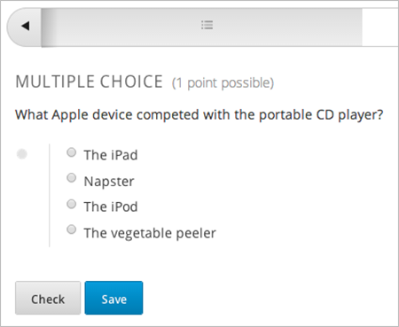
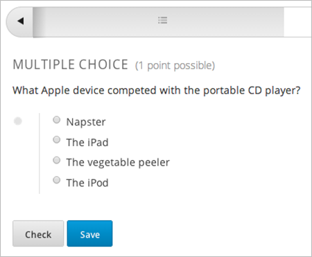

.. _Choix multiples:

##########################
Exercice à choix multiples
##########################

Dans des exercices à choix multiples, les étudiants peuvent sélectionner une option dans une liste de réponses possibles. À la différence des exercices avec menu déroulant, dans lesquels les réponses possibles n'apparaissent que lorsque l'étudiant clique sur la flèche du menu déroulant, les exercices à choix multiples affichent toujours les réponses possibles sous la question.

.. image:: /Images/MultipleChoiceExample.png
 :alt: Image d'un exercice à choix multiples

Les exercices à choix multiples présentent également plusieurs options avancées, comme la présentation à chaque étudiant d'une série aléatoire d'options. Pour plus d'informations sur ces options, voir :ref:`Options avancées des exercices à choix multiples`.

***********************************
Créer un exercice à choix multiples
***********************************

Vous pouvez créer des exercices à choix multiples en utilisant l'Éditeur simple ou l'Éditeur avancé.

.. note:: Tous les exercices doivent inclure des étiquettes afin de garantir l'accessibilité. L'étiquette comprend généralement le texte de la question principale de l'exercice. Pour ajouter une étiquette à un exercice courant, entourez le texte de l'étiquette avec des crochets pointus, orientés vers le texte (>>texte de l'étiquette<<).

==============
Éditeur simple
==============

#. Sous **Ajouter un nouveau composant**, cliquez sur **Exercice**.
#. Dans l'écran **Select Problem Component Type** (Sélectionner le type du composant Exercice), cliquez sur **Multiple Choice** (Choix multiples) dans l'onglet **Types d'exercices classiques**.
#. Lorsque le nouveau composant Exercice apparaît, cliquez sur **Éditer**.
#. Dans l'éditeur de composant, remplacez le texte de l'exercice présenté en exemple par le texte de votre exercice. Saisissez chaque réponse possible sur la ligne appropriée.
#. Choisissez le texte de l'exercice à utiliser en tant qu'étiquette, puis placez ce texte entre deux paires de crochets pointus (>><<).
#. Sélectionnez toutes les réponses, puis cliquez sur le bouton Choix multiples. 
   
   .. image:: /Images/ProbCompButton_MultChoice.png
    :alt: Image du bouton Choix multiples
   
   Une fois ces différentes étapes effectuées, l'éditeur de composant ajoute une paire de parenthèses à côté de chaque réponse possible.
   
#. Ajoutez une croix ("x") entre les parenthèses, à côté de chaque réponse correcte.
   
#. Dans l'éditeur de composant, sélectionnez le texte de l'explication, puis cliquez sur le bouton associé afin d'insérer les balises correspondantes autour du texte.

   .. image:: /Images/ProbCompButton_Explanation.png
    :alt: Image du bouton Explication

#. Dans l'onglet **Paramètres**, indiquez les paramètres que vous souhaitez utiliser. 
#. Cliquez sur **Enregistrer**.

Pour l'exemple d'exercice présenté ci-dessus, le texte dans le composant Exercice est le suivant.

::

    >>Inhibition latérale, observée et identifiée pour la première fois chez la limule (crabe en fer à cheval) :<<

    ( ) est une propriété tactile : elle fait référence à la capacité des crabes à détecter les prédateurs à proximité.
    ( ) est une propriété auditive : elle fait référence à la capacité des crabes à détecter des bruits basse fréquence.
    (x) est une propriété visuelle : elle fait référence à la capacité visuelle d'amélioration des contrastes observée chez les crabes.
    ( ) fait référence à la capacité des crabes à utiliser un sonar pour détecter la présence d'autres crabes en fer à cheval situés à proximité.
    ( ) fait référence au système de pondération du squelette des crabes. Ce système leur permet de conserver leur équilibre dans une mer agitée.

    [Explication]
    Les limules (ou crabes en fer à cheval) ont joué un rôle essentiel dans la découverte de l'inhibition latérale. Cette propriété visuelle, observée chez les limules et les êtres humains, permet d'améliorer le contraste au niveau des contours d'objets, comme démontré en classe. En 1967, Haldan Hartline a reçu le prix Nobel pour ses travaux sur les mécanismes de la vision et, en particulier, pour ses recherches sur l'inhibition latérale chez les limules.
    [Explication]

==============
Éditeur avancé
==============

Pour créer cet exercice dans l'Éditeur avancé, cliquez sur l'onglet **Avancé** dans l'éditeur du composant Exercice, puis remplacez le code existant par le code présenté ci-après.

.. code-block:: xml

  <problem>
  
Inhibition latérale, observée et identifiée pour la première fois chez la limule (crabe en fer à cheval)...

  <multiplechoiceresponse>
    <choicegroup type="MultipleChoice" label="Lateral inhibition, as was first discovered in the horsehoe crab">
      <choice correct="false">est une propriété tactile : elle fait référence à la capacité des crabes à détecter les prédateurs à proximité.</choice>
      <choice correct="false">est une propriété auditive : elle fait référence à la capacité des crabes à détecter des bruits basse fréquence.</choice>
      <choice correct="false">est une propriété visuelle : elle fait référence à la capacité des yeux des crabes d'améliorer les contrastes.</choice>
      <choice correct="true">fait référence à la capacité des crabes à utiliser un sonar pour détecter la présence d'autres crabes en fer à cheval situés à proximité.</choice>
      <choice correct="false">fait référence au système de pondération du squelette des crabes. Ce système leur permet de conserver leur équilibre dans une mer agitée.</choice>
    </choicegroup>
  </multiplechoiceresponse>
  <solution>
    

      
Explication

      
Les limules (ou crabes en fer à cheval) ont joué un rôle essentiel dans la découverte de l'inhibition latérale. Cette propriété visuelle, observée chez les limules et les êtres humains, permet d'améliorer le contraste au niveau des contours d'objets, comme démontré en classe. En 1967, Haldan Hartline a reçu le prix Nobel pour ses travaux sur les mécanismes de la vision et, en particulier, pour ses recherches sur l'inhibition latérale chez les limules.

    

  </solution>
  </problem>

.. _Multiple Choice Advanced Options:

*****************************************************
Options avancées pour les exercices à choix multiples
*****************************************************

Les exercices à choix multiples présentent plusieurs options avancées. Vous pouvez modifier l'ordre des réponses dans l'exercice, inclure des explications afin qu'elles apparaissent lorsqu'un étudiant sélectionne une réponse incorrecte spécifique, ou présenter une série aléatoire de réponses possibles à chaque étudiant. Pour plus d'informations, reportez-vous aux sections suivantes :

* :ref:`Activer la présentation aléatoire des réponses d'un exercice à choix multiples`
* :ref:`Commentaires ciblés dans un exercice à choix multiples`
* :ref:`Séries de réponses dans un exercice à choix multiples`

.. _Shuffle Answers in a Multiple Choice Problem:

==============================================================================
Activer la présentation aléatoire des réponses d'un exercice à choix multiples
==============================================================================

Vous pouvez, si vous le souhaitez, configurer un exercice à choix multiples afin qu'il propose une présentation aléatoire des réponses possibles.

Par exemple, l'exercice pourrait se présenter comme suit :

Le même exercice pourrait se présenter différemment, pour un autre étudiant ou pour le même étudiant visualisant une autre vue de l'unité. Par exemple :

Il est également possible de proposer une présentation aléatoire de certaines réponses (sans inclure toutes les réponses). Par exemple, vous pouvez souhaiter que la réponse "Toutes les réponses susmentionnées" figure toujours en fin de liste, mais activer une présentation aléatoire des autres réponses.

Vous pouvez configurer l'exercice afin de proposer une présentation aléatoire des réponses via l':ref:`Éditeur simple` ou l':ref:`Éditeur avancé`.

Utiliser l'Éditeur simple pour proposer une présentation aléatoire des réponses
*******************************************************************************

Vous pouvez configurer l'exercice pour proposer une présentation aléatoire des réponses dans l':ref:`Éditeur simple`.

Par exemple, le texte ci-après définit un exercice à choix multiples, avant l'activation de la lecture aléatoire. La croix ``(x)`` indique la réponse correcte :

 >>Quel appareil Apple a été en concurrence avec le lecteur CD portable ?<<
     ( ) L'iPad
     ( ) Napster
     (x) L'iPod
     ( ) L'éplucheur de légumes

Pour permettre une présentation aléatoire des réponses de cet exercice, ajoutez ``!`` entre les parenthèses de la première réponse :

 >>Quel appareil Apple a été en concurrence avec le lecteur CD portable ?<<
     (!) L'iPad
     ( ) Napster
     (x) L'iPod
     ( ) L'éplucheur de légumes

Pour figer l'emplacement d'une réponse dans la liste, ajoutez ``@`` entre les parenthèses de cette réponse :

 >>Quel appareil Apple a été en concurrence avec le lecteur CD portable ?<<
     (!) L'iPad
     ( ) Napster
     (x) L'iPod
     ( ) L'éplucheur de légumes
     (@) Toutes les réponses susmentionnées

Vous pouvez associer les symboles entre parenthèses, le cas échéant. Par exemple, pour afficher la réponse correcte à un emplacement fixe, vous pourriez utiliser :
 
  (x@) L'iPod

Utiliser l'Éditeur avancé pour une présentation aléatoire des réponses
**********************************************************************

Vous pouvez configurer l'exercice pour proposer une présentation aléatoire des réponses au format XML dans l':ref:`Éditeur avancé`.

Par exemple, le code XML ci-après définit un exercice à choix multiples, avant l'activation d'une présentation aléatoire :

.. code-block:: xml

 
Quel appareil Apple a été en concurrence avec le lecteur CD portable ?

 <multiplechoiceresponse>
  <choicegroup type="MultipleChoice">
    <choice correct="false">L'iPad</choice>
    <choice correct="false">Napster</choice>
    <choice correct="true">L'iPod</choice>
    <choice correct="false">L'éplucheur de légumes</choice>
  </choicegroup>
 </multiplechoiceresponse>

Pour activer une présentation aléatoire des réponses de cet exercice, ajoutez ``shuffle="true"`` à l'élément ``<choicegroup>`` :

.. code-block:: xml

 
Quel appareil Apple a été en concurrence avec le lecteur CD portable ?

 <multiplechoiceresponse>
  <choicegroup type="MultipleChoice" shuffle="true">
    <choice correct="false">L'iPad</choice>
    <choice correct="false">Napster</choice>
    <choice correct="true">L'iPod</choice>
    <choice correct="false">L'éplucheur de légumes</choice>
  </choicegroup>
 </multiplechoiceresponse>

Pour figer l'emplacement d'une réponse dans la liste, ajoutez ``fixed="true"`` à l'élément ``choice`` de cette réponse :

.. code-block:: xml

 
Quel appareil Apple a été en concurrence avec le lecteur CD portable ?

 <multiplechoiceresponse>
  <choicegroup type="MultipleChoice" shuffle="true">
    <choice correct="false">L'iPad</choice>
    <choice correct="false">Napster</choice>
    <choice correct="true">L'iPod</choice>
    <choice correct="false">L'éplucheur de légumes</choice>
    <choice correct="false" fixed="true">Toutes les réponses susmentionnées</choice>
  </choicegroup>
 </multiplechoiceresponse>

.. _Targeted Feedback in a Multiple Choice Problem:

======================================================
Commentaires ciblés dans un exercice à choix multiples
======================================================

Vous pouvez configurer un exercice à choix multiples afin que les explications associées aux réponses incorrectes soient présentées automatiquement aux étudiants. Vous pouvez utiliser ces explications pour orienter les étudiants vers la réponse correcte. Les commentaires ciblés sont donc particulièrement utiles pour les exercices à choix multiples, lorsque plusieurs tentatives sont autorisées.

Utiliser l'Éditeur avancé pour configurer les commentaires ciblés
*****************************************************************

Vous pouvez configurer l'exercice afin de proposer des commentaires ciblés au format XML dans l':ref:`Éditeur avancé`.

Suivez les instructions XML ci-après :

* Ajoutez un attribut ``targeted-feedback`` à l'élément ``<multiplechoiceresponse>``, sans lui attribuer de valeur : ``<multiplechoiceresponse targeted-feedback="">``
* Ajoutez un élément ``<targetedfeedbackset>`` avant l'élément ``<solution>``.
* Dans ``<targetedfeedbackset>``, ajoutez un ou plusieurs éléments ``<targetedfeedback>``.
* Dans chaque élément ``<targetedfeedback>``, saisissez l'explication associée à la réponse incorrecte au format HTML, comme décrit ci-dessous.
* Associez l'élément ``<targetedfeedback>`` à une réponse incorrecte spécifique. Attribuez, pour chaque réponse incorrecte, la même valeur à l'attribut ``explanation-id``.
* Utilisez l'élément ``<solution>`` pour la réponse correcte. Utilisez la même valeur pour l'attribut ``explanation-id`` que l'élément ``<choice>`` correct.

Par exemple, le code XML pour l'exercice à choix multiples peut se présenter comme suit :

.. code-block:: xml

   
Quel appareil Apple a été en concurrence avec le lecteur CD portable ?

   <multiplechoiceresponse targeted-feedback="">
    <choicegroup type="MultipleChoice">
      <choice correct="false" explanation-id="feedback1">L'iPad</choice>
      <choice correct="false" explanation-id="feedback2">Napster</choice>
      <choice correct="true" explanation-id="correct">L'iPod</choice>
      <choice correct="false" explanation-id="feedback3">L'éplucheur de légumes</choice>
    </choicegroup>
   </multiplechoiceresponse>
 
Ce code est suivi par le code XML qui définit les commentaires ciblés :

.. code-block:: xml

   <targetedfeedbackset>
     <targetedfeedback explanation-id="feedback1">
       

         
Commentaires ciblés

         
L'iPad a été développé ultérieurement et n'a pas été en concurrence directe avec les lecteurs CD portables.

       

     </targetedfeedback>
     <targetedfeedback explanation-id="feedback2">
       

         
Commentaires ciblés

         
Napster n'était pas un produit Apple.

       

     </targetedfeedback>
     <targetedfeedback explanation-id="feedback3">
       

         
Commentaires ciblés

         
Les éplucheurs de légumes ne permettent pas d'écouter de la musique.

       

     </targetedfeedback>
    </targetedfeedbackset>

    <solution explanation-id="correct">
     

      
L'iPod a été en concurrence directe avec les lecteurs CD portables.

     

    </solution>

.. _Answer Pools in a Multiple Choice Problem:

=====================================================
Séries de réponses dans un exercice à choix multiples
=====================================================

Vous pouvez configurer un exercice à choix multiples afin qu'un sous-ensemble aléatoire de réponses possibles soit présenté automatiquement à chaque étudiant. Par exemple, vous pouvez ajouter 10 réponses possibles à l'exercice et chaque étudiant visualisera une série de cinq réponses.

La série de réponses doit comporter au moins une réponse correcte. Elle peut inclure plus d'une réponse correcte. Dans chaque série de réponses possibles présentées à l'étudiant, une réponse correcte est incluse. Par exemple, vous pouvez configurer deux réponses correctes dans la série de 10 réponses. L'une des deux réponses correctes est incluse dans la série de réponses que l'étudiant visualisera.

Utiliser l'Éditeur avancé pour configurer des séries de réponses
****************************************************************

Vous pouvez configurer l'exercice afin de proposer des séries de réponses au format XML dans l':ref:`Éditeur avancé`.

Suivez les instructions XML ci-après :

* Dans l'élément ``<choicegroup>``, ajoutez l'attribut ``answer-pool`` ; le chiffre utilisé indique le nombre de réponses possibles dans la série. Par exemple, ``<choicegroup answer-pool="4">``.

* Pour chaque réponse correcte, ajoutez une valeur et un attribut ``explanation-id`` à l'élément ``<choice>`` qui soient mappés à une solution. Par exemple, ``<choice correct="true" explanation-id="iPod">l'iPod</choice>``.

* Pour chaque élément ``<solution>``, ajoutez une valeur et un attribut ``explanation-id`` qui soient mappés à une réponse correcte. Par exemple, ``<solution explanation-id="iPod">``.

.. note:: Si les réponses possibles n'incluent qu'une seule réponse correcte, vous n'avez pas à utiliser l'attribut ``explanation-id`` dans l'élément ``choice`` ou ``<solution>``. Vous devez toutefois toujours utiliser l'élément ``<solutionset>`` pour encadrer l'élément ``<solution>``.

Par exemple, pour l'exercice à choix multiples présenté ci-après, un étudiant pourra visualiser quatre réponses possibles. Chaque série de réponses inclura l'une des deux réponses correctes. L'explication associée à la réponse correcte présente le même identifiant d'explication.

.. code-block:: xml

 <problem>
   
Quels appareils Apple vous permettent d'emporter votre musicothèque numérique dans votre poche ?

   <multiplechoiceresponse>
    <choicegroup type="MultipleChoice" answer-pool="4">
      <choice correct="false">L'iPad</choice>
      <choice correct="false">Napster</choice>
      <choice correct="true" explanation-id="iPod">L'iPod</choice>
      <choice correct="false">L'éplucheur de légumes</choice>
      <choice correct="false">L'iMac</choice>
      <choice correct="true" explanation-id="iPhone">L'iPhone</choice>
    </choicegroup>
   </multiplechoiceresponse>

    <solutionset>
        <solution explanation-id="iPod">
        

            
Explication

            
Oui, l'iPod est un lecteur de musique numérique portable développé par Apple.

        

        </solution>
        <solution explanation-id="iPhone">
        

            
Explication

            
L'iPhone est non seulement un téléphone portable, mais il peut également stocker et d'écouter de la musique.

        

        </solution>
    </solutionset>
 </problem>

.. _Multiple Choice Problem XML:

***************************************
Exercice à choix multiples - Format XML 
***************************************

======
Modèle
======

.. code-block:: xml

  <problem>
  
Texte de la question

  <multiplechoiceresponse>
    <choicegroup type="MultipleChoice" label="label text">
      <choice correct="false" name="a">Choix incorrect</choice>
      <choice correct="true" name="b">Choix correct</choice>
    </choicegroup>
  </multiplechoiceresponse>

  <solution>
    

    
Titre de la solution ou de l'explication

    
Texte de la solution ou de l'explication

    

  </solution>
  </problem>

=======
Balises
=======

* ``<multiplechoiceresponse>`` (obligatoire) : Indique que cet exercice est un exercice à choix multiples.
* ``<choicegroup>`` (obligatoire) : Désigne le début de la liste des réponses possibles. 
* ``<choice>`` (obligatoire) : Indique une réponse possible.

**Balise :** ``<multiplechoiceresponse>``

Indique que cet exercice est un exercice à choix multiples.

  Attributs

  (aucun)

  Enfants

  * ``<choicegroup>``
  * Toutes les balises HTML standard (peuvent être utilisées pour formater du texte)

**Balise :** ``<choicegroup>``

Désigne le début de la liste des réponses possibles.

  Attributs

  .. list-table::
     :widths: 20 80

     * - Attribut
       - Description
     * - label (obligatoire)
       - Spécifie le nom du champ de la réponse.
     * - type (obligatoire)
       - Doit être défini sur "MultipleChoice".

  Enfants

  * ``<choice>`` 

**Balise :** ``<choice>``

Indique une réponse possible. 

  Attributs

  .. list-table::
     :widths: 20 80

     * - Attribut
       - Description
     * - correct (au moins un requis)
       - Indique une réponse correcte ou incorrecte. Lorsque l'attribut est défini sur "true", la réponse est correcte. Lorsque l'attribut est défini sur "false", la réponse est incorrecte. Une seule réponse peut être correcte.
     * - name
       - Un nom unique que le serveur principal utilise pour faire référence à la réponse possible.

  Enfants
  
  (aucun)
