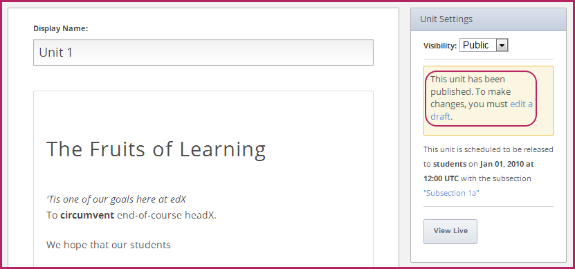
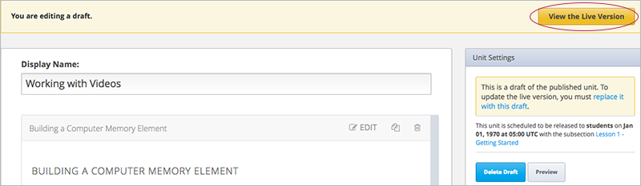
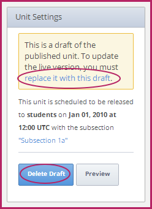

.. _Publishing Your Course:

##########################
Publication de votre cours
##########################

Lorsque vous avez configuré votre cours, établi un système d'évaluation et organisé les contenus, vous êtes prêt à publier votre cours et à le mettre à la disposition des étudiants.

Le processus peut s'avérer relativement complexe. Il est notamment important de comprendre ce que les étudiants peuvent afficher et de savoir comment modifier cet affichage.
Afin de vous y préparer, nous vous recommandons de lire attentivement les sections suivantes :

* :ref:`Publication et affichage de contenu : quelques règles`
* :ref:`Dates de publication`
* :ref:`Unités publiques et privées`
* :ref:`Modification des unités publiques`

.. _Understanding Content Students Can View:

*****************************************************
Publication et affichage de contenu : quelques règles
*****************************************************

Lorsque vous créez un cours dans Studio, les étudiants ne peuvent pas accéder au contenu du cours avant la date de début. 
Une fois la date de début passée, un étudiant pourra consulter les ressources pédagogiques en fonction de la configuration que vous aurez choisie pour les deux paramètres suivants : les dates de publication et la visibilité.

* La **date de publication**. Les sections et sous-sections ont des dates de publication. Si la date actuelle d'une section ou sous-section précède la date de publication, le contenu de cet élément de cours n'est pas encore publié. Les étudiants n'y ont donc pas accès. 
  
  Pour qu'un étudiant ait accès à une sous-section, cette sous-section et la section dont elle dépend doivent présenter une date de publication antérieure à la date actuelle. Il est possible qu'une section soit publiée, mais qu'une sous-section de cette section n'ait pas encore été publiée. Dans ce cas, les étudiants ne peuvent pas accéder à cette sous-section.
  
  L'équipe pédagogique peut consulter dans le LMS les sections et les sous-sections avant leur date de publication.
  
* L'unité doit être de type **Public**. Toutes les unités sont dotées d'un paramètre **Visibilité** qui est **Public** ou **Privé**.
  Lorsque vous créez une unité, elle est de type **Privé** par défaut. 
  
  Les étudiants ne peuvent pas consulter une unité de type **Privé**, même si la section et la sous-section dont elle dépend sont publiées.
  
  Les étudiants ne peuvent pas consulter une unité de type **Public** si la section et la sous-section dont elle dépend *ne sont pas* publiées.
  
  L'équipe pédagogique *ne peut pas* afficher les unités de type Privé dans le LMS.
  
En bref, pour que les étudiants aient accès à du contenu, l'unité doit être de type **Public**, et les section et sous-section dont elle dépend doivent être publiées. Si certains de ces critères ne sont pas respectés, les étudiants n'auront pas accès à cette unité.

Pour plus d'informations, reportez-vous aux sections suivantes de ce chapitre.

.. _Release Dates:

********************
Dates de publication
********************

Les dates de publication désignent les dates auxquelles le contenu est accessible aux étudiants. 
Ces dates sont définies au niveau de la section et de la sous-section. 

Une section et son contenu ne seront accessibles aux étudiants qu'une fois la date de publication passée. 
Toutefois, l'équipe pédagogique peut accéder au contenu dans le LMS, indépendamment de la date de publication définie.

.. note:: 
  Pour les cours créés avant le 14 janvier 2014, lorsque vous créez une nouvelle section ou sous-section, la date de publication par défaut est le 1er janvier 1970. Par conséquent, les unités publiques sont immédiatement publiées et vous devez remplacer cette date par une date future afin d'empêcher les étudiants d'accéder au contenu.  

  Pour les cours créés après le 14 janvier 2014, la date de publication par défaut est le 1er janvier 2030. Vous devrez alors définir la date de publication, en d'autres termes indiquer à partir de quel jour vous souhaitez que les étudiants aient accès au contenu.

============================================
Définir la date de publication d'une section
============================================

Vous pouvez définir la date et l'heure de publication de chaque section.
Avant la date et l'heure de publication, les étudiants ne peuvent pas afficher le contenu de cette section. 

Pour définir la date de publication d'une section :

#. Dans le champ **Will Release:** (Date de publication) en regard du titre de la section, cliquez sur **Éditer**.
#. Saisissez la date de publication au format MM/JJ/AAAA et l'heure UTC.
#. Cliquez sur **Enregistrer**.

=================================================
Définir la date de publication d'une sous-section
=================================================

Les sous-sections héritent de la date de publication de la section dont elles dépendent. Vous pouvez toutefois modifier cette date. Ainsi, des sous-sections différentes seront publiées à des moments différents.

Notez que si la date de publication d'une sous-section est antérieure à la date de publication de la section dont cette sous-section dépend, les étudiants ne pourront pas accéder à la sous-section avant que la date de publication de la *section* ne soit passée. Les dates de publication des sections sont prioritaires par rapport aux dates de publication des sous-sections.

Pour définir la date de publication d'une sous-section :

#. Ouvrez la sous-section.
#. Localisez la zone **Paramètres de la sous-section** dans le coin supérieur droit.
#. Saisissez la date de publication au format MM/JJ/AAAA et l'heure UTC.

======================================================
Synchroniser la date de publication d'une sous-section
======================================================

Il peut arriver qu'un membre de l'équipe pédagogique ou vous-même définissiez par erreur la date de publication d'une sous-section sur une date antérieure à la date de publication de la section dont cette sous-section dépend. Dans ce cas, la sous-section ne sera publiée qu'une fois la date de publication de la section passée.

Pour faciliter l'organisation de votre cours et permettre l'identification aisée des dates de publication problématiques, Studio signale les sous-sections dont les dates de publication sont antérieures à la date de publication de la section correspondante. Dans ce cas de figure, lorsque vous ouvrez la sous-section,
le message suivant apparaît dans la zone Paramètres de la sous-section :

``La date ci-dessus ne correspond pas à la date de publication de <Section Name> - <Section release date and time>. Synchroniser avec <Section Name>.``

Pour que la sous-section hérite de la date de publication ultérieure de la section, cliquez sur **Synchroniser avec <Section Name>**.

.. _Public and Private Units:

***************************
Unités publiques et privées
***************************

Les unités sont publiées à la date de publication de la sous-section à laquelle elles appartiennent.

En outre, les unités sont dotées d'un paramètre **Visibilité**, que vous pouvez définir sur **Public** ou **Privé**. 

Lorsque vous créez une unité, elle est de type **Privé** par défaut. 
Une unité de type Privé n'est jamais accessible aux étudiants, même si elle est incluse dans une sous-section publiée.

Lorsque vous modifiez le paramètre Visibilité d'une unité, défini sur Privé, et que vous le définissez sur Public, vous publiez l'unité et son contenu. 
Vous devez définir le paramètre Visibilité sur Public pour que les étudiants puissent accéder à l'unité.

L'équipe pédagogique ne peut pas afficher les unités de type Privé dans le LMS.

.. _Modifying Public Units:

*********************************
Modification des unités publiques
*********************************

Pour effectuer des révisions sur une unité publiée, créez et éditez un brouillon de cette unité. 

.. Avertissement : 
 La modification d'une unité publique peut avoir certaines implications. En effet, cette unité peut inclure des composants Exercice notés, que les étudiants ont peut-être déjà effectués.  Voir : ref:`Modification d'un exercice publié` pour plus d'informations.

Pour créer un brouillon, accédez à la page de l'unité, puis cliquez sur le lien **éditer un brouillon** dans le volet droit.

Lorsque vous éditez le brouillon d'une unité, vous pouvez afficher le contenu de l'unité de deux façons.

* Pour afficher le contenu déjà publié tel qu'il apparaît dans la version réelle du cours, cliquez sur **Voir la version réelle** dans le coin supérieur droit de la page.
* Pour afficher le contenu non publié en cours de révision, cliquez sur **Aperçu**.

Lorsque vous êtes prêt à publier le brouillon de votre contenu révisé, cliquez sur le lien **la remplacer avec ce brouillon** dans le volet droit. 

Si vous décidez que vous ne souhaitez pas conserver le contenu révisé, cliquez sur **Supprimer le brouillon**.

.. Avertissement : Les versions historiques des unités ne sont pas stockées par Studio. Après avoir remplacé la version réelle par un nouveau brouillon, vous ne pouvez pas rétablir cette version précédente de l'unité.
