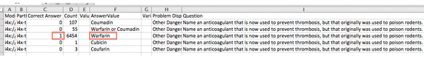

.. _Review_Answers:

############################
Réponses et données associées
############################

Vous pouvez consulter les réponses des étudiants aux exercices de votre cours. Vous pouvez notamment consulter la réponse qu'un étudiant donné a fournie à un exercice spécifique, télécharger un rapport de toutes les réponses aux exercices du cours, ou consulter un histogramme des réponses des étudiants à un exercice sélectionné.

* :ref:`Student_Answer_Submission`

* :ref:`Student_Answer_Distribution`

* :ref:`score_histogram`

.. _Student_Answer_Submission:

************************************************************
Vérifier la réponse soumise par un étudiant et consulter l'historique des soumissions
************************************************************

Pour un étudiant donné et un exercice spécifique, vous pouvez prendre connaissance de la réponse exacte qui a été soumise, du nombre d'essais effectués, ainsi que de la date et de l'heure de la soumission. Pour identifier l'étudiant, indiquez son nom d'utilisateur.

Pour consulter la réponse soumise par un étudiant :

#. Affichez la version réelle de votre cours.

#. Cliquez sur **Contenu du cours** et accédez à l'unité contenant l'exercice que vous souhaitez consulter.

#. Affichez l'exercice, puis cliquez sur **Historique des soumissions** sous l'exercice.

#. Saisissez le nom d'utilisateur de l'étudiant dont vous souhaitez consulter les travaux, puis cliquez sur **Afficher historique** en bas de la page.

  Les informations sur la réponse ou les réponses soumises par l'étudiant s'affichent.

Pour fermer la Visionneuse d'historique de soumission, cliquez sur la page du navigateur en dehors de la visionneuse.
   
.. _Student_Answer_Distribution:

****************************************
Distribution des réponses des étudiants
****************************************

Pour certains types d'exercices figurant dans votre cours, vous pouvez télécharger un fichier CSV incluant des données sur la distribution des réponses des étudiants. Les données de distribution incluses dans ce fichier concernent les types d'exercices listés ci-après :

* QCM avec cases à cocher (``<choiceresponse>``)
* QCM avec menu déroulant (``<optionresponse>``)
* Exercices à choix multiples (``<multiplechoiceresponse>``)
* Exercices avec saisie de chiffres (``<numericalresponse>``)
* Exercices avec saisie de texte (``<stringresponse>``)
* Exercices avec saisie d'expressions mathématiques (``<formularesponse>``)

Le fichier inclut une ligne pour chaque association exercice-réponse sélectionnée par vos étudiants. Par exemple, pour un exercice associé à cinq réponses possibles, le fichier compte cinq lignes, une pour chaque réponse sélectionnée par au moins un étudiant. Les exercices dont la fonction **Randomisation** a été activée dans Studio (parfois désignée par le terme de re-randomisation) comportent une ligne pour chaque association exercice-variante-réponse sélectionnée par vos étudiants. Voir :ref:`Paramètres de l'exercice`.

Le fichier CSV contient les colonnes suivantes :

.. list-table::
   :widths: 20 60
   :header-rows: 1

   * - Colonne
     - Description
   * - ModuleID
     - Identifiant interne du composant Exercice.
   * - PartID
     - Pour un composant Exercice qui contient plusieurs exercices, correspond à l'identifiant interne de chaque exercice individuel. Pour un composant Exercice qui contient un seul exercice, correspond à l'identifiant interne de cet exercice.
   * - Correct Answer
     - 0 si la valeur **AnswerValue** est incorrecte ou 1 si la valeur **AnswerValue** est correcte.
   * - Count
     - Nombre de fois que les étudiants ont saisi ou sélectionné cette réponse (celle-ci constitue leur soumission la plus récente pour l'exercice ou la variante d'exercice). Pour les exercices dont le nombre d'**essais** est défini sur une valeur supérieure à 1, cela signifie que chaque étudiant contribue à ce nombre à hauteur de 1 (valeur maximale), même si la même réponse est fournie au cours de plusieurs tentatives.
   * - ValueID
     - Identifiant interne de la réponse possible aux QCM avec cases à cocher ou aux exercices à choix multiples. Cette colonne demeure vide pour les QCM avec menu déroulant, les exercices avec saisie de chiffres, les exercices avec saisie de texte et les exercices avec saisie d'expressions mathématiques.
   * - AnswerValue
     - Étiquette de texte de la réponse possible aux QCM avec cases à cocher, aux QCM avec menu déroulant ou aux exercices à choix multiples. Valeur saisie par l'étudiant pour les exercices avec saisie de chiffres, les exercices avec saisie de texte et les exercices avec saisie d'expressions mathématiques.
   * - Variant
     - Pour les exercices utilisant le paramètre **Randomisation** dans Studio, contient l'identifiant unique de la variante de l'exercice. Cette colonne est vide pour les exercices qui n'utilisent pas le paramètre **Randomisation** ou qui utilisent l'option **Jamais** pour ce paramètre.
   * - Problem Display Name
     - **Nom d'affichage** défini pour l'exercice.
   * - Question
     - Étiquette relative à l'accessibilité qui apparaît au-dessus des réponses possibles ou du champ de saisie de texte de l'exercice. Dans l'Éditeur simple de Studio, ce texte est encadré par deux paires de crochets pointus (>>Question<<). Cette colonne reste vide pour les questions dont l'étiquette relative à l'accessibilité n'a pas été définie.

Les entrées sont triées par la valeur dans chaque colonne, en commençant par la colonne ModuleID à gauche et en passant aux colonnes suivantes à droite.

.. _Download_Answer_Distributions:

===================================================
Télécharger le rapport de distribution des réponses des étudiants
===================================================

Un processus automatisé est exécuté régulièrement sur les serveurs edX afin de mettre à jour le fichier CSV incluant les données relatives aux réponses des étudiants. Un lien vers la version la plus récente de ce fichier figure dans le tableau de bord de l'enseignant.

Pour télécharger la version la plus récente du fichier CSV :

#. Affichez la version réelle de votre cours.

#. Cliquez sur **Instructor** (Enseignant), puis sur **Téléchargement des données**.

#. Au bas de la page, cliquez sur le nom du fichier ``{course_id}_answer_distribution.csv``. Vous devrez peut-être faire défiler vers le bas pour trouver ce fichier.

==========================================================================
Forum aux questions sur le rapport de distribution des réponses des étudiants
==========================================================================

Les réponses aux questions relatives au rapport de distribution des réponses des étudiants sont présentées ci-après.   

**Il n'existe pas de rapport de distribution des réponses des étudiants pour mon cours. Comment puis-je le générer ?**

Les rapports de distribution des réponses des étudiants sont générés automatiquement et actualisés plusieurs fois par jour. Le fichier ``{course_id}_answer_distribution.csv`` est affiché à la suite de tous les fichiers ``{course_id}_grade_report_{date}.csv``. Vérifiez l'intégralité de la liste (en faisant défiler la liste des rapports disponibles jusqu'à la fin).

**Pourquoi certains exercices ne figurent-ils pas dans ce rapport ? Les types des exercices non répertoriés sont listés sous ** :ref:`Review_Answers`. Ce rapport inclut uniquement les exercices qu'au moins un étudiant a effectués depuis le début du mois de mars 2014. Pour ces exercices, ce rapport inclut uniquement les activités survenues après le mois d'octobre 2013.

**Pourquoi la colonne AnswerValue n'apparaît-elle pas pour certains de mes exercices ?**

Pour les QCM avec cases à cocher et les exercices à choix multiples, les réponses possibles sélectionnées par un étudiant après le début du mois de 2014 sont affichées comme décrit dans la réponse précédente. Les réponses possibles sélectionnées par au moins un étudiant après le mois d'octobre 2013, mais qui n'ont pas été sélectionnées depuis le début du mois de mars 2014, sont incluses dans le rapport. Elles ne présentent toutefois pas de valeur **AnswerValue**. La colonne **ValueID** présente des identifiants internes, comme choice_1 et choice_2, pour ces réponses.

**Pourquoi la colonne Question n'apparaît-elle pas pour certains de mes exercices ?**

La valeur indiquée dans la colonne **Question** correspond à l'étiquette relative à l'accessibilité de l'exercice.
Pour plus d'informations sur la configuration d'étiquettes pour les exercices, voir :ref:`Création d'exercices`.

En outre, pour les exercices qui utilisent le paramètre **Randomisation** dans Studio, si une réponse particulière n'a pas été sélectionnée depuis le début du mois de mars 2014, la colonne **Question** ne contient aucune valeur pour cette réponse.

**Mes étudiants indiquent qu'ils ont répondu à une question, mais celle-ci n'apparaît pas dans le rapport. Comment est-ce possible ?**

Seules les questions pour lesquelles le paramètre **Nombre d'essais maximum** est supérieur ou égal à 1 sont incluses dans ce rapport.

**J'ai apporté une correction à un exercice après sa publication. Comment puis-je identifier les étudiants qui ont tenté de répondre à cet exercice avant l'insertion de la modification ?**

Les valeurs de la colonne **Count** de l'exercice permettent d'avoir une vision complète de l'historique de l'exercice. Si vous modifiez un exercice après sa publication, il ne sera peut-être pas possible de déterminer quelles réponses ont été présentées avant et après l'insertion de la modification.

**Pourquoi la même réponse apparaît-elle dans deux lignes différentes lorsque je consulte le rapport dans une feuille de calcul ?**

Certains tableurs peuvent altérer les données dans le rapport CSV à des fins d'affichage. Par exemple, pour les réponses d'étudiant présentées dans un format différent, comme "0,5" et ".5", Excel inclut correctement les deux lignes différentes du fichier CSV, mais affiche la valeur **AnswerValue** dans les deux lignes comme suit : "0,5". Si vous notez que des réponses sont identiques sur des lignes distinctes avec des comptes séparés, vous pouvez consulter les données réelles et non modifiées en ouvrant le fichier CSV dans un éditeur de texte.

**Pourquoi des caractères étranges apparaissent-ils dans le rapport lorsque je le consulte dans une
feuille de calcul ?**

Le fichier CSV est encodé au format UTF-8. Toutefois, certains tableurs n'interprètent ni ne rendent correctement les caractères encodés en UTF-8. Par exemple, un rapport de distribution des réponses des étudiants présentant en français les valeurs AnswerValue s'affichera différemment dans Microsoft Excel pour Mac et dans le module Calc d'OpenOffice.

  Valeurs AnswerValue dans Microsoft Excel pour Mac :

   .. image:: ../Images/student_answer_excel.png
     :alt: Feuille de calcul qui remplace les caractères accentués français par des traits de soulignement

  Valeurs AnswerValue dans le module Calc d'OpenOffice :

   .. image:: ../Images/student_answer_calc.png
     :alt: Feuille de calcul qui affiche correctement les caractères accentués français

Si des caractères ne s'affichent pas correctement dans une feuille de calcul, tentez d'ouvrir le fichier CSV dans un autre tableur comme LibreOffice ou Apache OpenOffice.

==========================================================================
Interpréter le rapport de distribution des réponses des étudiants
==========================================================================

Vous pouvez utiliser le rapport de distribution afin de consulter les réponses soumises par les étudiants dans le cadre de leurs travaux. Il vous est ainsi possible d'évaluer la structure et l'exhaustivité de votre cours et des composants Exercice.

Par exemple, définissez une question dans Studio afin que celle-ci soit associée à la saisie d'une seule réponse correcte : "Warfarine". Lorsque vous produisez le rapport de distribution des réponses des étudiants, vous devez vérifier que cette réponse a en fait été marquée comme étant correcte : la valeur 1 est indiquée dans la colonne **Correct Answer** en regard de la valeur Warfarine indiquée dans la colonne **AnswerValue**.

Toutefois, lorsque vous consultez le rapport, vous notez que d'autres réponses, comme "Warfarine ou Coumadine", n'ont pas été configurées pour être marquées comme correctes dans Studio. Or, ce sont des réponses que vous pourriez (ou non) considérer comme étant correctes. La colonne **Correct Answer** indique que ces autres réponses ont été marquées comme incorrectes (0). Toutefois, pour les éditions futures de votre cours, vous souhaiterez peut-être réviser la question ou mettre à jour l'exercice afin de désigner les variations dans la réponse comme étant correctes.

De nombreux tableurs proposent des options de visualisation des données, comme les diagrammes ou les graphiques. Les diagrammes peuvent faciliter l'identification des erreurs courantes de vos étudiants.

Dans cet exemple, le rapport de distribution des réponses des étudiants est ouvert dans Microsoft Excel. Pour créer un diagramme qui présente le nombre d'étudiants ayant sélectionné différentes réponses à une question à choix multiples, placez les colonnes **AnswerValue** et **Count** l'une à côté de l'autre. Après avoir sélectionné (en cliquant dessus) et fait glisser les cellules du rapport contenant les données à utiliser dans le diagramme, cliquez sur la barre d'outils des diagrammes, puis sur le type de diagramme souhaité.

.. note:: Pour plus d'informations sur l'utilisation de ces options, reportez-vous à l'aide du tableur que vous utilisez. Vous devrez peut-être modifier votre feuille de calcul, en ré-agençant les colonnes, par exemple. Avant de commencer, enregistrez une copie de sauvegarde du fichier d'origine que vous avez téléchargé. 

Vous pouvez adapter le contenu de votre cours en fonction des erreurs courantes faites par les étudiants. Dans cet exemple, la plupart des étudiants ont sélectionné la réponse correcte. Toutefois, le nombre de réponses incorrectes peut permettre de définir les modifications à apporter au cours.

.. _score_histogram:

**************************************************
Afficher un histogramme des notes obtenues pour un exercice spécifique
**************************************************

Vous pouvez afficher un diagramme de la distribution des notes pour un exercice donné. 

.. note:: Pour afficher la distribution des notes pour un exercice donné, vous devez utiliser son identifiant unique. Vous pouvez afficher l'histogramme des exercices dont l'identifiant unique inclut le préfixe ``/problem/``. Voir :ref:`find_URL`.

Pour afficher la distribution des notes pour un exercice :

#. Affichez la version réelle de votre cours.

#. Cliquez sur **Instructor** (Enseignant), puis cliquez sur **Analyses**. 

#. Dans la section de distribution des scores (ou notes), sélectionnez un exercice en utilisant son identifiant unique.

   La page **Analyses** est mise à jour afin d'afficher l'histogramme des notes pour cet exercice.

   .. image:: ../Images/score_histogram.png
     :alt: Graphique présentant le nombre d'étudiants ayant reçu des notes différentes pour la **question** d'un exercice sélectionné :  LMS-2522

===================================================
Interpréter un histogramme des notes
===================================================

L'histogramme des notes d'un exercice sélectionné présente les informations suivantes.

   .. image:: ../Images/score_histogram_callouts.png
     :alt: Histogramme présentant le nombre students scored (étudiants comptabilisés pour l'exercice) ; les nombres sur l'axe des x indiquent les notes illustrées sur le graphique

* L'axe des x indique le nombre de points que les étudiants peuvent recevoir pour l'exercice, sans pondération. Bien que des valeurs décimales figurent sur l'axe des x, chaque note est un nombre entier. Le nombre entier à gauche de la barre illustrée sur le graphique correspond à la note qui s'applique.

* L'axe des y indique le nombre d'étudiants ayant soumis une réponse pour l'exercice et ayant validé leur réponse.

* Au-dessus du graphique, le nombre **students scored** (étudiants comptabilisés pour l'exercice) apparaît. Ce nombre indique le nombre total de dossiers de la base de données associés à l'exercice : il inclut non seulement les étudiants ayant soumis et validé leur réponse afin d'être notés, mais également les étudiants qui ont ouvert l'exercice, mais ne l'ont pas encore terminé.

* Un processus automatisé est exécuté chaque semaine (approximativement) sur les serveurs edX. Il permet de mettre à jour les histogrammes. Ce processus est exécuté moins fréquemment que le processus mettant à jour le rapport de distribution des réponses des étudiants : il peut donc arriver que, lors d'un cours, le nombre d'étudiants affiché dans l'histogramme des notes soit relativement différent de la valeur **Count** du même exercice dans le rapport de distribution des réponses des étudiants.