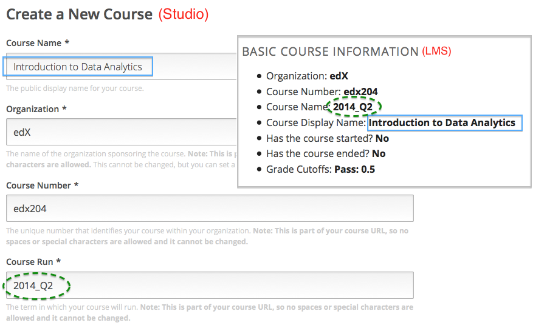

.. _Course Data:

################
Données du cours
################

Après avoir créé un cours, vous pouvez accéder aux informations relatives au cours depuis le
tableau de bord de l'enseignant. Sont notamment présentés :

* des informations d'identification du cours ;

* des informations précisant si le cours a commencé ou s'il est terminé ;

* le seuil de notation défini (réussite/échec).

******************************
Consulter les données du cours
******************************

Pour afficher les informations relatives au cours :

#. Affichez la version réelle de votre cours.

#. Cliquez sur **Instructor** (Enseignant), puis sur **Infos** le cas échéant. 

   La section **Informations de base relatives au cours** de la page qui s'ouvre répertorie les informations sur le cours.

    .. image:: ../Images/Instructor_Dash_Course_Info.png
     :alt: Section Informations de base relatives au cours du tableau de bord de l'enseignant 

************************************************************
Sources des informations de base relatives au cours - Studio
************************************************************

Les données de cours qui apparaissent dans le tableau de bord de l'enseignant sont définies dans Studio ou dérivées de données que vous avez définies dans Studio.

* **Organisme** : Spécifié dans Studio lorsque vous créez le cours. Est intégré à l'URL du cours et ne peut être modifié.

* **Numéro du cours** : Spécifié dans Studio lorsque vous créez le cours. Est intégré à l'URL du cours et ne peut être modifié.

* **Nom du cours** : Spécifié dans Studio lorsque vous créez le cours. Est intégré à l'URL du cours et ne peut être modifié. Dans Studio, ce champ est nommé **Cours dispensé**.

* **Nom d'affichage du cours** : Spécifié dans Studio lorsque vous créez le cours. Dans Studio, ce champ est nommé **Nom du cours**. 

  Ce nom peut être modifié dans Studio (non recommandé s'il s'agit de la version en cours de votre cours) :
  Dans le menu **Paramètres**, sélectionnez **Paramètres avancés**. La valeur de la clé de stratégie **Nom d'affichage du cours** définit le nom du cours qui n'apparaît que dans le LMS.

  L'illustration suivante présente côte à côte les informations recueillies par Studio pour un nouveau cours et les mêmes informations de la section **Informations de base relatives au cours** du tableau de bord de l'enseignant.

* **Le cours a-t-il commencé ?** : Réponse dérivée de la **date de début du cours** et de la date actuelle. Cette date peut être modifiée dans Studio (non recommandé s'il s'agit de la version réelle de votre cours) : sélectionnez **Paramètres** > **Dates & Détails**.

* **Le cours est-il terminé ?** : Réponse dérivée de la **date de fin du cours** et de la date actuelle. Cette date peut être modifiée dans Studio (non recommandé s'il s'agit de la version réelle de votre cours) : sélectionnez **Paramètres** > **Dates & Détails**.

* **Seuils de notation** : Spécifiés dans Studio lorsque vous définissez le seuil de notation (note de passage). Les étudiants qui obtiennent exactement la note correspondant au seuil de notation valident leur cours (réussite).
  Cette note peut être modifiée dans Studio (non recommandé s'il s'agit de la version réelle de votre cours) :
  sélectionnez **Paramètres** > **Évaluation**.
