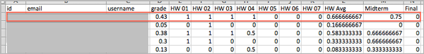

.. _Grades:

############################
Évaluation et notes des étudiants
############################

Après la création du cours, vous pouvez revoir les informations sur la configuration de la notation de votre cours et accéder aux notes des étudiants à tout moment. Vous pouvez également ajuster les notes des étudiants obtenues lors d'un exercice donné, pour un seul étudiant ou pour tous les étudiants. Pour plus d'informations sur les données de notation auxquelles vous pouvez accéder et sur les modifications que vous pouvez effectuer, reportez-vous aux rubriques suivantes :

* :ref:`Review_grades`

* :ref:`Access_grades`

* :ref:`gradebook`

* :ref:`check_student_progress`

* :ref:`Adjust_grades`

Vous pouvez consulter les réponses des étudiants aux exercices de votre cours. Vous pouvez notamment vérifier la réponse qu'un étudiant donné a fournie à exercice sélectionné, télécharger toutes les données relatives aux réponses des exercices du cours, ou consulter un graphique élaboré à partir de l'ensemble des données de réponses d'un exercice sélectionné. Voir :ref:`Review_Answers`.

Pour plus d'informations sur l'élaboration d'une politique de notation et l'utilisation de composants Exercice dans votre cours, voir :ref:`Définition d'une politique de notation` ou :ref:`Utilisation de composants Exercice`.

Important : Si vous apportez des modifications à votre politique de notation après le début d'un cours, les étudiants peuvent voir les effets de vos modifications dans les pages **Progression**. Veillez à annoncer toutes les modifications effectuées sur votre page **Infos**.

.. _Review_grades:

********************************************************
Revoir la configuration de la notation de votre cours
********************************************************

Vous pouvez revoir les types de travaux que vous avez notés et leurs coefficients respectifs dans le tableau de bord de l'enseignant.

Lorsque vous créez votre cours dans Studio, vous établissez sa politique de notation. Lorsque le cours a commencé, vous pouvez visualiser une représentation XML des types de travaux proposés par votre cours. Les coefficients associés, utilisés pour noter les étudiants, sont également présentés.

..   Sous la liste des types de travaux notés et leurs coefficients, toutes les unités et sous-sections de type *Public* contenant un travail sont répertoriées.

#. Affichez la version réelle de votre cours.

#. Cliquez sur **Instructor** (Enseignant), puis sur **Téléchargement des données** > **Configuration de la notation**.

   La liste des types de travaux proposés dans votre cours est affichée. Dans cet exemple, le type Devoir présente un coefficient de 0,3, soit 30 % de la note. 

   .. image:: ../Images/Grading_Configuration.png
     :alt: Représentation XML des types de travaux proposés dans votre cours et coefficients de notation associés

   Dans Studio, pour définir ces informations, sélectionnez **Paramètres** > **Évaluation**. Pour plus d'informations, voir :ref:`Configurer les types de travaux`.

   .. image:: ../Images/Grading_Configuration_Studio.png
     :alt: Exemple Studio de type de devoir et de coefficient

.. _Access_grades:

********************************************************
Générer des notes pour les étudiants inscrits (tous les cours)
********************************************************

Pour tout cours, vous pouvez générer des notes, puis télécharger un fichier incluant les résultats de chaque étudiant inscrit. 

Lorsque vous lancez les calculs afin de noter les travaux des étudiants, un processus est lancé sur les serveurs edX. La complexité de la configuration de votre notation et le nombre d'étudiants inscrits à votre cours déterminent la durée de ce processus. Lorsque le processus de notation est terminé, vous pouvez télécharger un rapport des notes calculées dans un fichier CSV (de l'anglais comma-separated values, renvoyant à un fichier de valeurs séparées par des virgules).

Pour les cours comptant moins de 200 inscrits, vous pouvez également choisir de consulter les notes des étudiants dans le tableau de bord de l'enseignant. Voir :ref:`gradebook`.

Pour générer le rapport de notes pour les étudiants actuellement inscrits à votre cours :

#. Affichez la version réelle de votre cours.

#. Cliquez sur **Instructor** (Enseignant), puis sur **Téléchargement des données**.

#. Pour commencer le processus de notation, cliquez sur **Générer le rapport de notes**.

  Un message d'état indique que le processus de notation est en cours. Ce processus peut être long. Pendant qu'il s'exécute, vous pouvez toutefois consulter d'autres pages et effectuer d'autres tâches.

4. Pour suivre la progression du processus de notation, rechargez la page dans votre navigateur et faites défiler vers le bas jusqu'à la section **Tâches Enseignant en attente**.

==========================================
Télécharger les notes des étudiants inscrits
==========================================

Lorsque vous demandez un rapport de notes pour vos étudiants, vous obtenez un fichier horodaté. Ce fichier inclut les colonnes permettant d'identifier chaque étudiant : identifiant, e-mail et nom d'utilisateur. Il présente également une colonne pour chaque travail inclus dans votre configuration de notation : chaque devoir, exercice, examen de mi-semestre, examen final, et tout autre type de travail que vous aurez ajouté à votre cours. 

Important : Ce fichier contient des données confidentielles et personnelles (nominatives), susceptibles d'être soumises aux dispositions de la loi FERPA (de l'anglais Family Educational Rights and Privacy Act : loi américaine sur les droits à l'instruction et la protection de la vie privée des familles). Par conséquent, lorsque vous ouvrez ou enregistrez ce fichier, veillez à respecter la politique de gestion des données de votre établissement.

Pour télécharger le fichier de notes d'un étudiant :

#. Affichez la version réelle de votre cours.

#. Cliquez sur **Instructor** (Enseignant), puis sur **Téléchargement des données**.

#. Pour ouvrir ou enregistrer un fichier de rapport de notes, cliquez sur le nom du fichier ``{course_id}_grade_report_{date}.csv`` au bas de la page.

.. note:: Pour prévenir toute distribution accidentelle des données des étudiants, téléchargez ces fichiers en cliquant sur les liens figurant sur cette page. Ne copiez pas ces liens à d'autres emplacements afin de les réutiliser, car ils ne sont valides que 5 minutes. Les liens sur cette page expirent également si la page est ouverte pendant plus de 5 minutes : si nécessaire, actualisez la page afin de générer de nouveaux liens. 

.. _Interpret the Grade Report:

=====================================
Interpréter le rapport de notes
=====================================

Les rapports de notes offrent un aperçu des notes cumulées lors du cours, par travail, pour chaque étudiant actuellement inscrit. 

Vous pouvez ouvrir les fichiers ``{course_id}_grade_report_{date}.csv`` dans un tableur afin de trier les données, les présenter sous forme de graphiques et les comparer.

Le fichier CSV contient une ligne de données pour chaque étudiant ainsi que des colonnes qui présentent les informations suivantes :

* Les identifiants de l'étudiant : un **identifiant** interne, une adresse **e-mail** et un **nom d'utilisateur**.

* La **note** globale : note totale obtenue par un étudiant dans le cours. Cette valeur est exprimée sous forme décimale : un étudiant ayant obtenu une note de 0,65 a en fait obtenu 65 % de la note dans le cours. Un étudiant ayant obtenu une note de 1 a obtenu 100 % de la note. 

* Chaque colonne associée à un **{assignment type} {number}** ({numéro} {type de travail}), défini dans votre configuration de notation, présente la note obtenue par un étudiant donné pour ce travail spécifique. Par exemple, la colonne HW 03 (Devoirs 03) présente les notes du troisième devoir.

* Une colonne **{assignment type} Avg** (Moy {type de devoir}) présente la note moyenne actuelle de l'étudiant pour ce type de travail : par exemple, HW Avg (Moy Devoirs).

.. note:: Les rapports de notes ne présentent aucune information sur les questions individuelles incluses dans les travaux. Ils ne présentent également pas les distributions des réponses des étudiants.

.. _gradebook:

********************************************************
Consulter les notes des étudiants inscrits (petits cours)
********************************************************

Pour les cours comptant jusqu'à 200 inscrits, vous pouvez consulter un bulletin de notes dans le tableau de bord de l'enseignant. 

#. Affichez la version réelle de votre cours.

#. Cliquez sur **Instructor** (Enseignant), puis sur **Admin Étudiant**. Pour les cours comptant moins de 200 étudiants inscrits, cet onglet inclut un **Bulletin de notes de l'étudiant**.

#. Cliquez sur **Voir le bulletin de notes**. Les notes sont calculées et le bulletin de notes est affiché.

   .. image:: ../Images/Student_Gradebook.png
     :alt: Bulletin de notes avec des lignes pour les étudiants et des colonnes pour les types de travaux

Le bulletin de notes inclut les fonctions suivantes.

* Vous pouvez cliquer sur le nom d'utilisateur de l'étudiant dans chaque ligne afin de consulter
  la page **Progression dans le cours** de cet étudiant. Voir :ref:`check_student_progress`.

* Il existe une colonne pour chaque **{assignment type} {number}** ({numéro} {type de travail}) défini dans votre configuration de notation ; les notes obtenues par un étudiant donné pour ce travail spécifique y sont présentées. 

  Le bulletin de notes n'a pas de barre de défilement ; il est toutefois possible de le faire glisser : pour afficher les colonnes masquées d'un côté du bulletin de notes, cliquez sur le bulletin, puis faites le glisser vers la gauche ou la droite afin de faire apparaître ces colonnes.

* Pour les types de travaux qui incluent plus d'un travail, une colonne **{assignment type} Avg** (Moy {type de travail}) affiche chaque note moyenne actuelle de l'étudiant pour ce type de travail.

* La colonne **Total** présente la note globale de l'étudiant dans le cours à la date du jour. Cette valeur est exprimée sous forme de nombre entier : un étudiant ayant obtenu une note de 65 a en fait obtenu 65 % de la note dans le cours. Un étudiant ayant obtenu une note de 100 a obtenu 100 % de la note.

* Pour filtrer les données qui s'affichent, vous pouvez utiliser l'option **Rechercher des étudiants**.
  Cette option est sensible à la casse et limite le nombre de lignes affichées dans le bulletin de notes aux noms d'utilisateur correspondant à votre saisie.

.. _check_student_progress:

****************************************
Vérifier la progression d'un étudiant
****************************************

Afin de vérifier la progression d'un étudiant donné, vous pouvez identifier la ligne spécifique dans le rapport de notes ou consulter la page **Progression** de l'étudiant. Le page **Progression** inclut notamment un diagramme : les notes de l'étudiant obtenues pour tous les travaux notés y sont relevées, ainsi que la note globale établie à la date du jour. Sous le diagramme, chaque travail et note obtenue sont indiqués.

Pour consulter la page **Progression** d'un étudiant, vous devez fournir une adresse e-mail ou un nom d'utilisateur. Vous pouvez vérifier la progression des étudiants inscrits au cours ou de ceux qui se sont désinscrits.

Lorsqu'ils sont connectés au cours, les étudiants peuvent afficher un diagramme similaire et la liste des travaux (associés à leur propre progression uniquement). Voir :ref:`Vue Étudiant`.

Pour afficher la page **Progression** d'un étudiant :

#. Affichez la version réelle de votre cours.

#. Cliquez sur **Instructor** (Enseignant), puis sur **Admin Étudiant**.

#. Dans la section Examen des notes spécifiques des étudiants, saisissez l'adresse e-mail ou le nom d'utilisateur de l'étudiant.

#. Cliquez sur **Suivi de Progression Étudiant**.

   La page **Progression** de l'étudiant affiche un diagramme ; ce dernier présente les notes de chaque devoir, exercice, examen de mi-semestre, examen final, et de tout autre type de travail proposé par votre cours, ainsi que la note globale obtenue pour le cours à la date du jour. 

   .. image:: ../Images/Student_Progress.png
     :alt: Diagramme de la page Progression d'un étudiant : inclut un histogramme incluant les notes obtenues pour chaque travail 

   Pour plus d'informations sur un travail spécifique, placez le curseur sur la valeur choisie dans le diagramme. Une brève description est alors affichée. 

   .. image:: ../Images/Student_Progress_mouseover.png
     :alt: Page Progression avec info-bulle associée au X désignant le dernier devoir : cela signifie que la note la plus basse obtenue pour un devoir est retirée

   Sous le diagramme, les sous-sections sont répertoriées à gauche et les unités contenant les travaux sont listées à droite. Les notes de chaque exercice effectué par l'étudiant sont affichées.

   .. image:: ../Images/Student_Progress_list.png
     :alt: Partie inférieure d'une page Progression pour le même étudiant avec la note obtenue pour chaque exercice de la première sous-section du cours 

=============================================
Interpréter la page Progression d'un étudiant
=============================================

Le diagramme des notes d'un étudiant affiché sur la page **Progression** et les lignes de données sur le rapport de notes présentent les notes obtenues lors des travaux réalisés dans un ordre similaire. Toutefois, la note cumulée globale obtenue pour le cours est indiquée à un autre emplacement de la page **Progression**.

Dans ce rapport de notes présenté en exemple, l'étudiant choisi a obtenu une note de 0,43 (43 %). 

.. image:: ../Images/Grade_Report_example.png
  :alt: Rapport de notes du cours : les informations d'un étudiant sont indiquées par un rectangle

* Sur chacun des quatre premiers devoirs, l'étudiant a obtenu 1 (100 %), mais la note 0 (0 %) est indiquée pour chacun des trois travaux restants. 

  Notez toutefois que la note moyenne actuelle de l'étudiant pour les devoirs est de 0,666666667 (67 %) : dans ce cours, le devoir associé à la note la plus basse est retiré. La moyenne présentée est donc calculée sur six travaux et non sur sept. 

* L'étudiant a obtenu une note de 0,75 (75 %) à l'examen de mi-semestre, et une note de 0 (0 %) à l'examen final. 

Sur la page **Progression** de l'étudiant, vous avez accès aux mêmes informations, présentées sous forme de graphique ; toutefois, la note "totale" de l'étudiant (43 %) est présentée complètement à droite.

Le diagramme sur la page **Progression** présente des étiquettes sur l'axe des y associées aux plages d'évaluation définies pour le cours. Dans cet exemple, l'option Pass (Réussite à l'examen) est définie sur 60 %. Ainsi, à la fin du cours, les étudiants présentant une note supérieure ou égale à 0,60 peuvent recevoir leur certificat.

.. note:: Les notes des étudiants indiquées sur la page **Progression** constituent un aperçu de l'état actuel de la base de données des notes obtenues aux exercices. Parfois, ces notes peuvent ne pas correspondre aux notes véritables obtenues. Par exemple, des asynchronismes peuvent se produire si le coefficient d'un exercice en cours a été modifié et que certains étudiants n'ont pas resoumis leurs réponses pour cet exercice.

.. _A Students View:

=============================================
Vue de la progression dans le cours d'un étudiant
=============================================

Les étudiants peuvent suivre leur progression. Il leur suffit de cliquer sur **Progression** dans la barre de navigation du cours. La progression de l'étudiant, mesurée par le biais des notes obtenues dans le cadre du cours, s'affiche en haut de cette page, au-dessus des notes de sous-section. La progression est visualisée sous la forme d'un diagramme : y figurent les entrées de tous les travaux, la note totale actuelle (exprimée en pourcentage) obtenue jusqu'à présent et la note (pourcentage) devant être obtenue pour chaque seuil de notation. Vous trouverez ci-après l'exemple d'une progression (edX101).
 
.. image:: ../Images/StudentView_GradeCutoffs.png
  :width: 800
  :alt: Image de la page Progression d'un étudiant avec mise en surbrillance des légendes des seuils de notation
 
Sur cette page, l'étudiante peut voir que le cours edX101 est un cours Pass/Fail (réussite/échec) avec un seuil de notation de 34 %. La rubrique d'évaluation contient un seul type de travail, appelé Learning Sequence (Séquence d'apprentissage) ; au total, 11 travaux doivent être effectués. Il est également possible de constater que cette étudiante n'a répondu correctement qu'à deux travaux. La note totale (exprimée en pourcentage) qu'elle a jusqu'à présent obtenue pour ce cours est égale à 6 %. En faisant passer le curseur de la souris au-dessus de la barre de progression, l'étudiante peut obtenir des statistiques sur le coefficient de chaque travail. 
 
Plus bas sur la page **Progression**, la liste de toutes les sous-sections du cours présente les notes enregistrées pour l'étudiante, pour tous les exercices proposés dans le cadre du cours.
Vous trouverez ci-après la page **Progression** de l'étudiante mentionnée dans l'exemple précédent :
 
.. image:: ../Images/StudentView_Problems.png
   :width: 800
   :alt: Image de la page Progression d'un étudiant avec mise en surbrillance des exercices
 
Remarque : Les notes en points des sections notés sont appelées "Scores aux exercices". Les notes en points des sections non notées sont appelées "Scores d'entrainement".

.. _Adjust_grades:

***********************************
Ajuster des notes
***********************************

Vous pouvez ajuster les notes d'un étudiant à la fois ou de tous les étudiants inscrits au cours. Par exemple, les bêta-testeurs de votre cours peuvent évaluer les nombreuses réponses différentes, correctes et incorrectes, afin de vérifier que vous cours a été configuré comme vous le souhaitez. Les étudiants peuvent également rapporter des erreurs après publication du cours.
Lorsqu'une erreur est identifiée ou corrigée, ou si vous décidez que vous devez modifier un exercice après que des étudiants ou des bêta-testeurs ont tenté d'y répondre, vous pouvez :

* réévaluer les réponses soumises. Voir :ref:`rescore`.

* réinitialiser le nombre d'essais de l'étudiant afin que ce dernier puisse faire de nouvelles tentatives. Voir :ref:`reset_attempts`.

Vous pouvez effectuer ces ajustements pour un seul étudiant ou pour tous les étudiants inscrits à votre cours. Pour effectuer un ajustement, vous devez utiliser l'identifiant de position unique de l'exercice. Voir :ref:`find_URL`.

Une autre technique d'ajustement de la note consiste à supprimer définitivement de la base de données l'historique ou l'"état" d'un étudiant associé à un exercice donné. Vous ne pouvez supprimer un état que pour un étudiant à la fois. Par exemple, vous comprenez rapidement qu'un exercice doit être réécrit après soumission de seulement quelques réponses par des étudiants. Pour résoudre cette situation, vous réécrivez l'exercice, puis supprimez l'état des étudiants concernés afin qu'ils puissent faire une nouvelle tentative. Voir :ref:`delete_state`.

.. _find_URL:

==================================================
Rechercher l'identifiant de position unique d'un exercice
==================================================

Lorsque vous créez les exercices d'un cours, edX affecte à chacun une position unique. Pour ajuster la note obtenue à un exercice ou pour en afficher les données, vous devez spécifier la position de l'exercice.

Pour rechercher l'identifiant de position unique d'un exercice :

#. Affichez la version réelle de votre cours.

#. Cliquez sur **Contenu du cours** et accédez à l'unité contenant l'exercice.

#. Affichez l'exercice, puis cliquez sur **Info de débogage pour l'équipe pédagogique**.

   Les informations relatives à l'exercice s'affichent, notamment sa **position**. 

   .. image:: ../Images/Problem_URL.png
      :alt: Vue Débogage équipe pédagogique d'un exercice avec identifiant de position

4. Pour copier la position de l'exercice, sélectionnez toute la position, cliquez avec le bouton droit de la souris, puis sélectionnez **Copier**.

Pour fermer la visionneuse Débogage équipe pédagogique, cliquez sur la page du navigateur en dehors de la visionneuse.

.. _rescore:

===================================================
Réévaluer les soumissions d'un exercice d'un étudiant
===================================================

Chaque exercice que vous définissez pour votre cours inclut une réponse correcte. Il peut également inclure une tolérance ou d'autres options acceptables. Si vous décidez de modifier ces valeurs, vous pouvez réévaluer les réponses déjà soumises. Pour un exercice spécifié, vous pouvez réévaluer les travaux soumis par un seul étudiant ou les soumissions de chaque étudiant inscrit.

.. note:: Vous ne pouvez réévaluer que les exercices pour lesquels une réponse correcte a été saisie dans edX Studio. Cette procédure ne peut pas être utilisée pour réévaluer des exercices notés par un évaluateur externe.

Réévaluer la soumission d'un étudiant
-----------------------------------------------

Pour réévaluer l'exercice d'un seul étudiant, vous devez utiliser le nom d'utilisateur ou l'adresse e-mail de cet étudiant.

#. Affichez la version réelle de votre cours.

#. Cliquez sur **Contenu du cours** et accédez au composant contenant l'exercice que vous souhaitez réévaluer.

#. Affichez l'exercice, puis cliquez sur **Info de débogage pour l'équipe pédagogique**. La visionneuse Débogage équipe pédagogique s'ouvre.

#. Dans le champ **Nom d'utilisateur**, saisissez l'adresse e-mail ou le nom d'utilisateur de l'étudiant, puis cliquez sur **Réévaluer la soumission d'un étudiant**. Un message apparaît, indiquant un ajustement réussi.

#. Pour fermer la visionneuse Débogage équipe pédagogique, cliquez sur la page du navigateur en dehors de la visionneuse.

Réévaluer les soumissions de tous les étudiants
------------------------------------

Pour spécifier quel exercice réévaluer, vous devez indiquer son identifiant de position.
Voir :ref:`find_URL`. Pour réévaluer un exercice :

#. Affichez la version réelle de votre cours.

#. Cliquez sur **Instructor** (Enseignant), puis sur **Admin Étudiant**. 

#. Dans la section **Ajustement spécifique des notes** de la page, saisissez la position unique de l'exercice, puis cliquez sur **Réévaluer TOUTES les soumissions d'exercice des étudiants**.

#. Lorsqu'une boîte de dialogue apparaît, vous indiquant que le processus de réévaluation est en cours, cliquez sur **OK**.

   Ce processus, réalisé pour tous les étudiants inscrits, peut être long. Il est exécuté en arrière-plan, ce qui vous permet de consulter d'autres pages et d'effectuer d'autres tâches.

6. Pour afficher les résultats du processus de réévaluation, cliquez sur **Afficher
   l'historique des tâches d'arrière plan pour l’étudiant** ou **Afficher Historique des tâches d'arrière plan pour l'exercice**.

   Un tableau affiche l'état du processus de réévaluation pour chaque étudiant ou exercice.

.. note:: Vous pouvez utiliser une procédure similaire pour réévaluer la réponse soumise par un seul étudiant pour un exercice donné. Accédez à la section **Ajustement de note spécifique à un étudiant** de la page afin d'y saisir l'adresse e-mail ou le nom d'utilisation de l'étudiant, ainsi que l'identifiant unique de l'exercice, puis cliquez sur **Réévaluer la soumission d'un étudiant**. 

.. _reset_attempts:

===================================================
Réinitialiser les essais d'un étudiant pour un exercice donné
===================================================

Lorsque vous créez un exercice, vous pouvez limiter le nombre d'essais qu'un étudiant peut effectuer pour répondre correctement à cet exercice. En cas de problèmes inattendus pour un exercice, vous pouvez réinitialiser le nombre d'essais d'un étudiant donné afin que ce dernier puisse recommencer. Si un comportement inattendu affecte tous les étudiants de votre cours, vous pouvez réinitialiser le nombre d'essais pour tous les étudiants. 

Pour plus d'informations sur la modification d'un exercice publié, notamment sur les solutions, voir :ref:`Modification d'un exercice publié`.

Réinitialiser les essais d'un étudiant
---------------------------------------------

Pour réinitialiser le nombre d'essais d'un étudiant, vous devez utiliser le nom d'utilisateur ou l'adresse e-mail de cet étudiant.

#. Affichez la version réelle de votre cours.

#. Cliquez sur **Contenu du cours** et accédez au composant contenant l'exercice que vous souhaitez réinitialiser.

#. Affichez l'exercice, puis cliquez sur **Info de débogage pour l'équipe pédagogique**. La visionneuse Débogage équipe pédagogique s'ouvre.

#. Dans le champ **Nom d'utilisateur**, saisissez l'adresse e-mail ou le nom d'utilisateur de l'étudiant, puis cliquez sur **Réinitialiser Essais des étudiants**. Un message apparaît, indiquant un ajustement réussi.

#. Pour fermer la visionneuse Débogage équipe pédagogique, cliquez sur la page du navigateur en dehors de la visionneuse.

Réinitialiser les essais de tous les étudiants
------------------------------------

Pour réinitialiser le nombre d'essais dont les étudiants bénéficient pour un problème donné, vous devez utiliser l'identifiant unique de l'exercice. Voir :ref:`find_URL`. Pour réinitialiser les essais de tous les étudiants :

#. Affichez la version réelle de votre cours.

#. Cliquez sur **Instructor** (Enseignant), puis sur **Admin Étudiant**. 

#. Pour réinitialiser le nombre d'essais pour tous les étudiants inscrits, utilisez la section **Ajustement spécifique des notes** de la page. Saisissez la position unique de l'exercice, puis cliquez sur **Réinitialiser TOUS les essais des étudiants**.

#. Une boîte de dialogue apparaît, indiquant que le processus de réinitialisation est en cours. Cliquez sur **OK**. 

   Ce processus peut être long. Il est exécuté en arrière-plan, ce qui vous permet de consulter d'autres pages et d'effectuer d'autres tâches.

7. Pour afficher les résultats du processus de réinitialisation, cliquez sur **Afficher l'historique des tâches d'arrière plan pour l’étudiant** ou **Afficher Historique des tâches d'arrière plan pour l'exercice**.

   Un tableau affiche l'état du processus de réinitialisation pour chaque étudiant ou exercice.

.. note:: Vous pouvez utiliser une procédure similaire pour réinitialiser le nombre d'essais d'un seul étudiant pour un exercice donné. Accédez à la section **Ajustement de note spécifique à un étudiant** de la page afin d'y saisir l'adresse e-mail ou le nom d'utilisation de l'étudiant, ainsi que l'identifiant unique de l'exercice, puis cliquez sur **Réinitialiser Essais des étudiants**. 

.. _delete_state:

=============================================
Supprimer l'état de l'étudiant associé à un exercice
=============================================

Pour supprimer de la base de données la totalité de l'historique d'un étudiant pour un exercice donné, vous devez utiliser le nom d'utilisateur ou l'adresse e-mail de cet étudiant. 

Important : Ce processus entraîne la suppression définitive de l'état de l'étudiant. Cette action ne peut pas être annulée.

Vous pouvez utiliser la visionneuse Débogage équipe pédagogique ou le tableau de bord de l'enseignant pour supprimer l'état de l'étudiant.

Pour utiliser la visionneuse Débogage équipe pédagogique :

#. Affichez la version réelle de votre cours.

#. Cliquez sur **Contenu du cours** et accédez au composant contenant l'exercice.

#. Affichez l'exercice, puis cliquez sur **Info de débogage pour l'équipe pédagogique**. La visionneuse Débogage équipe pédagogique s'ouvre.

#. Dans le champ **Nom d'utilisateur**, saisissez l'adresse e-mail ou le nom d'utilisateur de l'étudiant, puis cliquez sur **Supprimer l'état de l’étudiant**. Un message apparaît, indiquant un ajustement réussi.

#. Pour fermer la visionneuse Débogage équipe pédagogique, cliquez sur la page du navigateur en dehors de la visionneuse.

Pour utiliser le tableau de bord de l'enseignant, vous devez utiliser l'identifiant unique de l'exercice.
Voir :ref:`find_URL`.

#. Cliquez sur **Instructor** (Enseignant), puis sur **Admin Étudiant**. 

#. Dans la section **Ajustement de note spécifique à un étudiant** de la page, saisissez l'adresse e-mail ou le nom d'utilisation de l'étudiant, ainsi que l'identifiant unique de l'exercice, puis cliquez sur **Supprimer l'état de l'étudiant pour ce problème**.